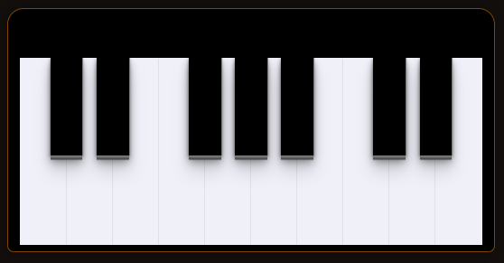

# Piano DOM Manipulation

Piano criado usando HTML, CSS e JS.. 

Projeto feito com auxilio de uma Masterclass da [@Rocketseat](https://www.instagram.com/rocketseat_oficial/) focado em manipulação de DOM com JavaScript.  

### Prévia visual do projeto

## ⚡️ Primeiros Passos

Para iniciar o projeto, abra o arquivo `index.html` e se divirta utilizando seu mouse e teclado :).

